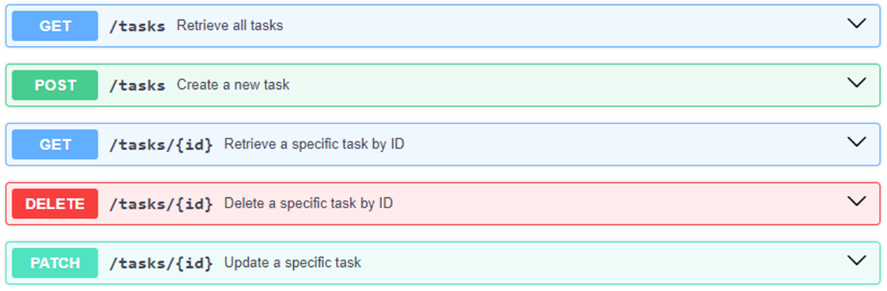

<div align="center">

  <h1>API Design Training</h1>
  
    Welcome to the API Design Training Project! This project demonstrates API design using a number of tools. This project serves as an example of how to structure and document APIs effectively.

    The brief here is to design a simple Task Management API using OpenAPI definition. Each session builds on the last, showing progression, introducing new concepts and tools.

    As more sessions and examples are completed, additional `session` folders will be added.

<!-- Badges -->
<p>
<a href="https://github.com/craigashields/api-design-training/graphs/contributors">
    
</a>
<a href="">
    
</a>
<a href="https://github.com/craigashields/api-design-training/network/members">
    
</a>
<a href="https://github.com/craigashields/api-design-training/stargazers">
    
</a>
<a href="https://github.com/craigashields/api-design-training/issues/">
    
</a>
</p>  
<h4>
    <a href="https://github.com/craigashields/api-design-training/issues/">Report Bug</a>
  <span> · </span>
    <a href="https://github.com/craigashields/api-design-training/issues/">Request a Session</a>
  </h4>
</div>

## Table of Contents

- [Features](#features)
- [Installation](#installation)
- [Project Structure](#project-structure)
- [Sessions](#sessions)
- [Acknowledgements](#acknowledgements)
- [License](#license)
- [Contact](#contact)
- [Disclaimer](#disclaimer)

## Features

- **API Specification**: Clear and concise API specifications using OpenAPI.
- **Linting**: Linting to ensure your API specification meets best practices.
- **Mocking**: Tools to test your API endpoints.
- **Documentation**: Automatically generated, high-quality documentation.

## Installation

To get started with this project, follow the steps below:

1. **Clone the repository:**

   ```
   git clone https://github.com/yourusername/api-design-training.git
   cd api-design-training
   ```

   Remember to delete the existing .git folder

2. **Initialize git** (optional)

   ```
   git init
   ```

There are no dependencies in the top level. Each session folder contains instructions on how to use it.

## Project Structure

The project's structure is organized as follows:

```
API-Design-Training/
├── .gitignore
├── session1/
│   ├── node_modules/
│   ├── package.json
│   └── ...
├── session2/
│   ├── node_modules/
│   ├── package.json
│   └── ...
└── ...
```

## Sessions

Each session will build on the last but remain self-contained.

| Session Title                            | Description                                                            | Completed |
| ---------------------------------------- | ---------------------------------------------------------------------- | --------- |
| Session 1 - Setup and Basic OpenAPI Spec | Initial OpenAPI spec for Task API                                      | Yes       |
| Session 2 - APIOps with Github Actions   | Enhance OpenAPI spec and add CI/CD activities for linting and bundling | no        |

More to be added as progression is made. The end state will be to have the following API endpoints



## Acknowledgements

I'd like to mention a number of people who's books I have read or who I follow, as the information they provide is fantastic and has helped put the sessions together.

- Lukas Rosenstock
- Joshua Ponelat
- Erik Wilde
- Ikenna Nwaiwu

## License

This project is licensed under the MIT License. See the [LICENSE](LICENSE) file for details.

## Contact

If you have any questions or suggestions, feel free to reach out:

## Disclaimer

This project will serve as a practical exercise in API design, focusing on essential features such as CRUD operations, proper use of HTTP methods, and JSON data handling, along with the basics of APIOps.

However, it's important to acknowledge that mastering API design cannot be achieved in just one hour or even a few of hours. It requires time, practice, and continuous learning and improvement.

One of the biggest misconceptions in learning API design is the idea that you can fully grasp it by following quick tutorials promising results in '5 minutes'. This is simply not feasible. Designing a robust, scalable, consumer-friendly and secure API is a skill that demands a significant investment in learning and practice. As you embark on this journey, remember that your understanding will deepen through persistent effort and real-world application.

A topic that is not covered in earnest is security. Although there are specific things in OpenAPI specification that adds a level of security, this is a whole different ball game. It requires deep analysis of data and your requirements therefore everything here should be treated as learning material and not 'you must do this or this is all you have to do'.

Another point is around tooling. The session projects use various tools. These are tools that I am familiar with and have used previously. They are not the only ones out there. There are some that are free and others that you must pay for. Determining which to use depends on requirements and experience. In each session README, I'll give a list of tools/packages used and alternatives.
