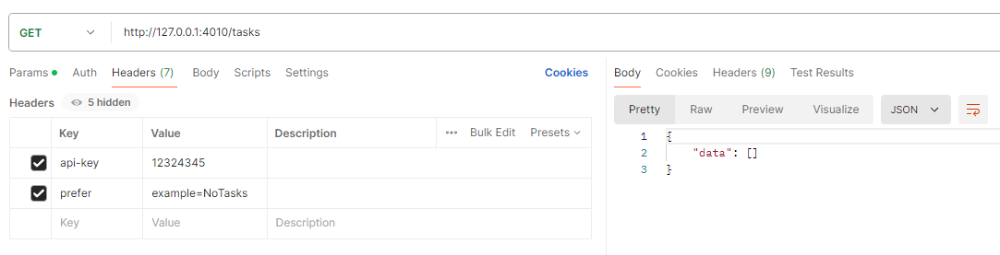

# Session 1 - Setup and Basic OpenAPI Spec

## Introduction

The first project sets up a basic project structure for use with the Redocly CI

## Table of Contents

- [Introduction](#introduction)
- [Tools / Packages](#toolsandpackages)
- [Installation](#installation)
- [Project Structure](#project-structure)
- [Usage](#usage)

## Tools and Packages

This project uses the following:

- **[Redocly CLI](https://redocly.com/docs/cli)**

  The Redocly CLI is an open-source command line tool for working with OpenAPI specifications. It provides many features such as

  - OpenAPI file management
  - Documentation generation
  - API governance (including linting)

  There are alternatives out there for each of these functions, some include:

  | Tool                                                              | Purpose                                |
  | ----------------------------------------------------------------- | -------------------------------------- |
  | [Stoplight - Spectral](https://stoplight.io/open-source/spectral) | Linting                                |
  | [Stoplight - Elements](https://stoplight.io/open-source/elements) | Documentation                          |
  | [Swagger](https://swagger.io/)                                    | Linting, Documentation, API Management |
  | [Postman](https://www.postman.com/)                               | Documentation and API Management       |
  | [Optic](https://www.useoptic.com/docs)                            | Linting and Documentation              |
  | [Vacuum](https://quobix.com/vacuum/api/getting-started/)          | Linting                                |

  And there are many more!

  This project will use Redocly for specification management and linting.

- **[Stoplight Prism](https://github.com/stoplightio/prism/blob/master/README.md)**

  Prism is a Mock Server and Validation Proxy. It is used to simulate endpoints from an OpenAPI specification.

  Alternatives include:

  | Tool                                                        |
  | ----------------------------------------------------------- |
  | [Postman](https://www.postman.com/)                         |
  | [Mockoon](https://mockoon.com/)                             |
  | [Wiremock](https://www.wiremock.io/)                        |
  | [Wiretap](https://quobix.com/articles/introducing-wiretap/) |

  And there are many more!

- **[Stoplight Elements](https://github.com/stoplightio/elements)**

  Elements provides documentation based off an OpenAPI specification.

  In this project, we'll use Elements with a basic HTML template and not as a react component.

  Alternatives include:

  | Tool                                             |
  | ------------------------------------------------ |
  | [Postman](https://www.postman.com/)              |
  | [Redocly](https://redocly.com/docs/cli/api-docs) |
  | [RapiDoc](https://rapidocweb.com/)               |
  | [Swagger](https://swagger.io/)                   |
  | [Slate](https://github.com/slatedocs/slate)      |
  | [Readme](https://readme.com/)                    |

  And there are many more!

- **Live Server**

  I would recommend using [Live Server](https://marketplace.visualstudio.com/items?itemName=ritwickdey.LiveServer) extension for VS Code if you want to use Stoplights documentation.

- **Postman**

  I would recommend using Postman for testing out the mocked API endpoint but there are other options available.

## Installation

To get started with this project:

1. **Install Dependencies:**

   Ensure you are in the `session1` folder

   ```
   npm install
   ```

   This will install the `Redocly CLI` and `Stoplight Prism`

## Project Structure

The `session1` project's structure is organized as follows:

```
session1/
├── docs
├── openapi/
│   ├── components/
|   |   ├── examples/
|   |   ├── headers/
|   |   ├── parameters/
|   |   ├── responses/
|   |   ├── schemas/
|   |   └── securitySchemas/
│   ├── paths/
│   └── openapi.yaml
├── package.json
└── redocly.yaml
```

Each is explain below

### docs

This folder contains 2 HTML files

- Index.html

  This is the default html file if you want to use Redocly's documentation generator. We'll touch on this in the usage section

- todo.html

  This is the html file you can use if you choose to try out Stoplight Elements documentation generator.

### openapi

This folder contains all of our OpenAPI specification details. Visit the [OpenAPI specification](https://spec.openapis.org/oas/latest.html) for more information but at a high-level, the OpenAPI specification is broken down like so:


#### components

Reusable objects to be used across the API, organized into various subcategories

##### examples

Provides example data for different parts of the API.

This folder current includes examples for success and error response that the API will return.

##### headers

Specifies headers that can be sent or received by API operations.

No headers are currently present for this first session.

##### parameters

Defines query, header, path, or cookie parameters for API operations.

No parameters are currently present for this first session.

##### requestBodies

Details the request body content and format for different endpoints.

No requestBodies are currently present for this first session.

##### responses

Describes possible responses from API endpoints.

- **ErrorResponse.yaml**
- **TasksResponse.yaml**

##### schemas

Describes the structure and data types of the request and response bodies.

The simple data model for Task Management API is below:


This data model has then been converted to 4 main schemas

- **NewTask.yaml**
- **Task.yaml**
- **TaskBase.yaml**
- **UpdateTask.yaml**

The remaining schemas have been created for use in API responses.

- **Error.yaml**
- **Tasks.yaml**

##### securitySchemas

Specifies the available security mechanisms used in the API.

No securitySchemas are currently present for this first session.

#### paths

Lists the available API endpoints and their operations, such as GET, POST, PUT, and DELETE.

- **tasks.yaml**

### openapi.yaml

This is main openapi specification file. This file includes the following information

- Info - Contains metadata about the API, including its title, version, and description.
- Server - Specifies the base URL for the API, including optional descriptions and variables.
- Security - Defines the security schemes (e.g., OAuth2, API keys) that can be used across the API.
- Tags - Provides additional metadata for API documentation grouping and organizing related endpoints.
- ExternalDocs - Points to additional external documentation for the API.

It then links to the path files which in-turn link to the components.

## Usage

Before playing around and making any changes yourself, I'd suggest the following steps.

1. **Build**

I would first recommend running the build command. This will then create a `dist` folder and will bundle all of the individual `yaml` files together into a single spec.

```
npm run build
```

This executes a [Redocly bundle command](https://redocly.com/docs/cli/commands/bundle)

You should then see `/dist/openapi.yml`

2. **Generate Documentation**

Next, let's make sure you can generate the documentation. You could actually just copy the contents from the `dist/openapi.yml` file and paste it into the [Swagger Editor](https://editor-next.swagger.io/) to see if everything looks ok but let's check that Stoplight Elements is working.

- StopLight Elements

  If you want to use Elements, simply:

  1. Open `docs/todo.html`
  2. Right Click inside the content window
  3. Select `Open with Live Server`

  This will open up the documentation in your default browser.

- Redocly Docs

  If you want to try out the Redocly docs command:

  1. Run `npm run start` in the terminal
  2. Click the link provided after 'Preview server running at:'

  This will open up the documentation in your default browser.

3. **Mocking**

Mocking in the context of APIs refers to the practice of simulating the behavior of an API.

This involves creating mock endpoints that mimic the responses of actual endpoints, often without requiring a fully functional backend. Mocking allows developers to interact with an API as if it were live, providing predefined responses to requests.

It has many benefits, the main being parallel development, where Frontend and backend teams can work independently. Frontend developers can start working with mock APIs while the backend is still under development. This in turn can significantly speed up development.

You can carry out unit testing, error simulation and more. Mocking is usually attributed to the build process after design, but mocking during the design phase can help to demonstrate and refine API behavior and contract before the actual implementation.

To start using `Prism`, simply run the following command (ensuring you are in the `session1` folder):

```
prism mock dist/openapi.yml
```

> **Note**
>
> If there is an issue with starting the server. You might have to install `prism` globally like so:
>
> ```
> npm install -g @stoplight/prism-cli
> ```

You will see in the terminal that it has started

```
[12:21:13] » [CLI] ...  awaiting  Starting Prism…
[12:21:13] » [CLI] i  info      GET        http://127.0.0.1:4010/tasks
[12:21:13] » [CLI] ►  start     Prism is listening on http://127.0.0.1:4010
```

Now you can try out the endpoint. Copy and paste the tasks endpoint `http://127.0.0.1:4010/tasks` into Postman (ensure `GET` is specified as the verb) or an application of your choice and click `send`

You will likely get this error:

```
{
    "code": 401,
    "message": "Unauthorized",
    "description": "Authentication credentials were missing or incorrect",
    "documentation": "https://docs.example.com/api-credentials"
}
```

This is because of Prisms schema validation and decision engine. The logs will show something like this

```
[12:23:37] » [HTTP SERVER] get /tasks i  info      Request received
[12:23:37] »     [NEGOTIATOR] i  info      Request contains an accept header: */*
[12:23:37] »     [VALIDATOR] ‼  warning   Request did not pass the validation rules
[12:23:37] »     [VALIDATOR] ×  error     Invalid security scheme used
[12:23:37] »     [NEGOTIATOR] √  success   Found response 401. I'll try with it.
[12:23:37] »     [NEGOTIATOR] √  success   The response 401 has an example. I'll keep going with this one
[12:23:37] »     [NEGOTIATOR] √  success   Responding with the requested status code 401
[12:23:37] »     [NEGOTIATOR] i  info      > Responding with "401"
[12:23:37] »     [VALIDATOR] ×  error     Violation: request Invalid security scheme used
```

In the OpenAPI specification it shows that `api-key` is the security on OpenAPI but it has not been specified on your test request. See [Prism Mocking](https://github.com/stoplightio/prism/blob/master/docs/guides/01-mocking.md) for more information about the decision engine.

To fix this, simply add `api-key` header to the request (the value doesn't matter)


Send the request again and you should get a valid response.

By default, Prism returns the first example it finds for the endpoint. However, in the `TasksResponse.yaml`, there are two example

```
description: OK
content:
  application/json:
    schema:
      $ref: ..\schemas\Tasks.yaml
    examples:
      Tasks:
        $ref: ..\examples\TasksResponse.yaml
      NoTasks:
        $ref: ..\examples\TasksResponse-NoTasks.yaml
```

If you want to view a specific example, you can add the `prefer` header to the API request and it will return the example.

Here is an example of the response where the `NoTasks` example was specified



## Playtime!

OK, you're all setup, have a playaround, make changes, break things and learn.

One thing to note is that if you make any changes, the Redocly CLI will automatically lint the specification to ensure it's valid and to help you identify any mistakes. You will see that files may turn amber or red and the contents of the file may be underlined with amber or red. Hover over these and you'll be provided with the error.

You can also run the linting command yourself, whenever you like

```
npm run lint
```
